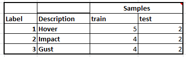
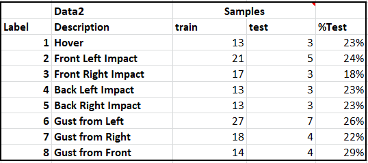
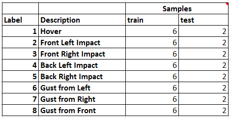
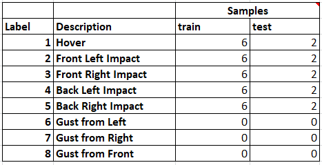

# DroneProject

## Data file definitions

These are the data libraries that have been built to test with. The current code depends on a label dictionary which is compatible with Data2 and beyond. 

### Data
This is the first sample that was collected with just impacts and simualted wind. Both were singular in direction.

### Data2
This is the complete library of all tests. It has hover, directional impact, and directional gust data.

### Data4
This is a reduced data set containing 8 of each sample from Data2.

### Data5
This is a reduced data set containing only hover and impact data, with gust data removed.
